Unsupervised HDR Imaging
=====
<!-- Unofficial implementation of Unsupervised HDR Imaging: What Can Be Learned from a Single 8-bit Video? -->
This repository is the unofficial implementation of ["Unsupervised HDR Imaging: What Can Be Learned from a Single 8-bit Video?"](https://arxiv.org/abs/2202.05522) using PyTorch.  
The main idea of this paper is to assume that a single video contains a variety of exposures and train to map from higher to lower exposures.

Different the original paper, it does not implementation sampling of frames during training and uses avg+max pooling instead of mixed pooling.  

## Demo
||-4 fstop|-2 fstop|0 fstop|2 fstop|4 fstop|
|---|---|---|---|---|---|
|Ground Truth|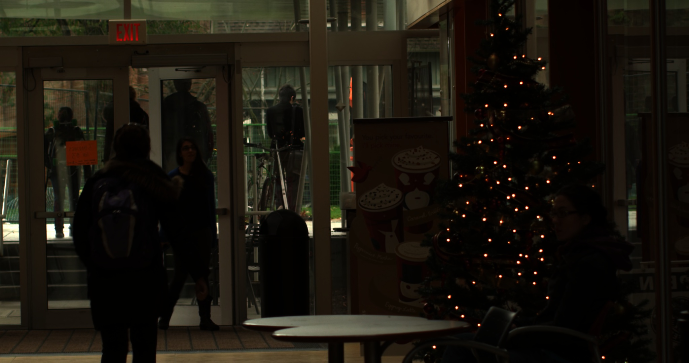|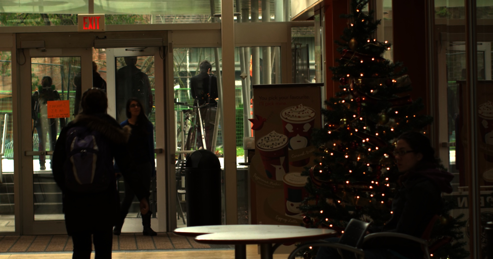|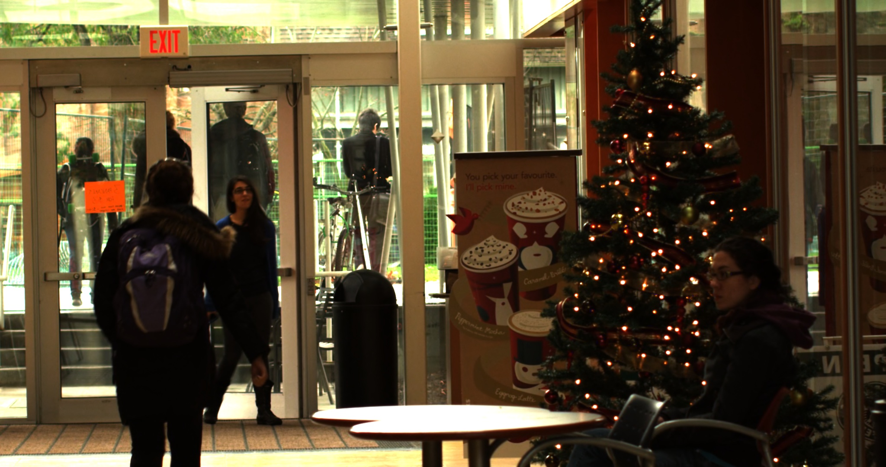|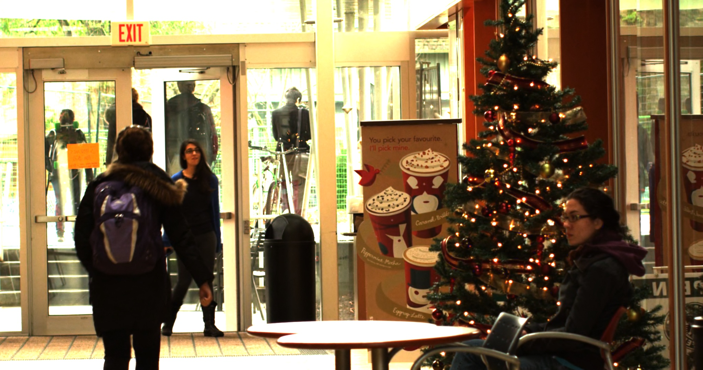||
|Predict|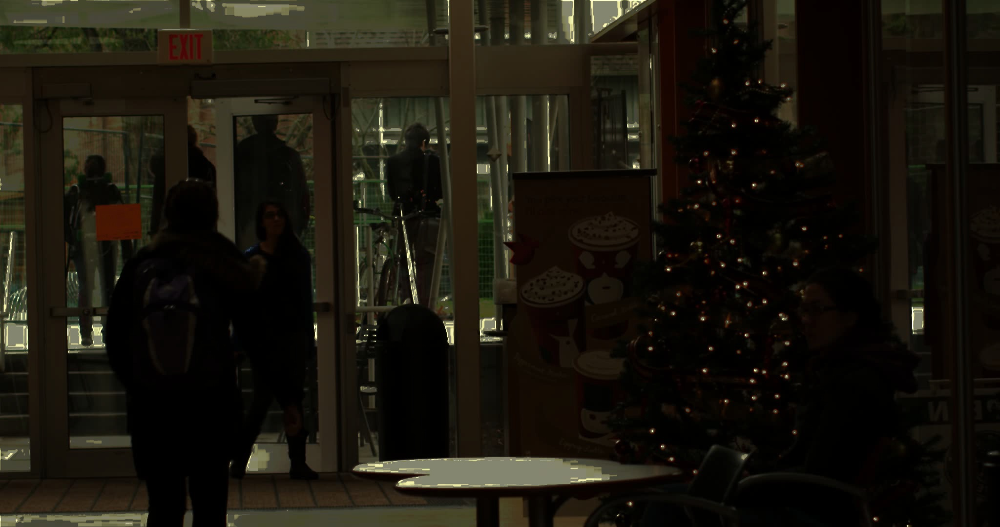|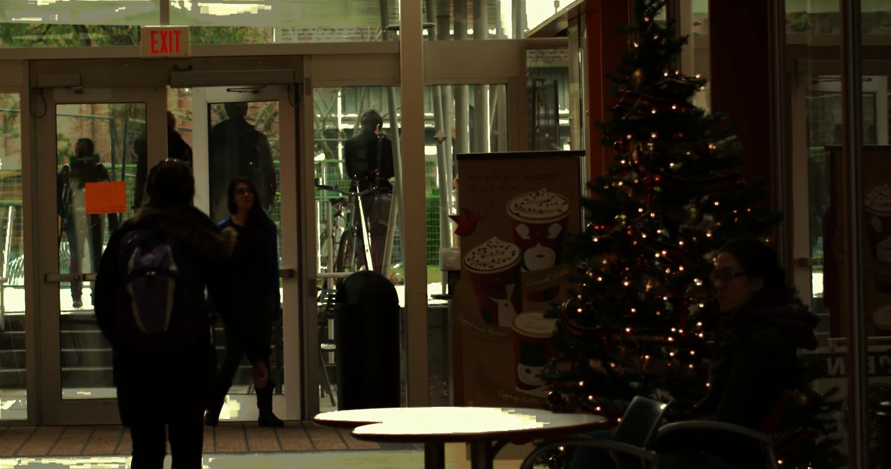|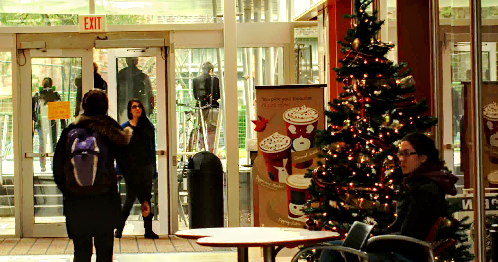|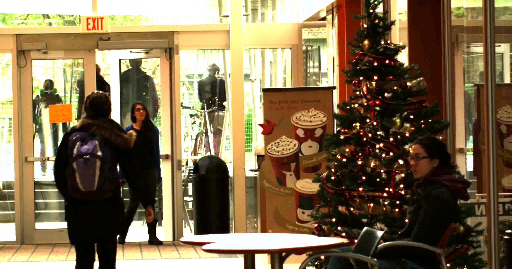|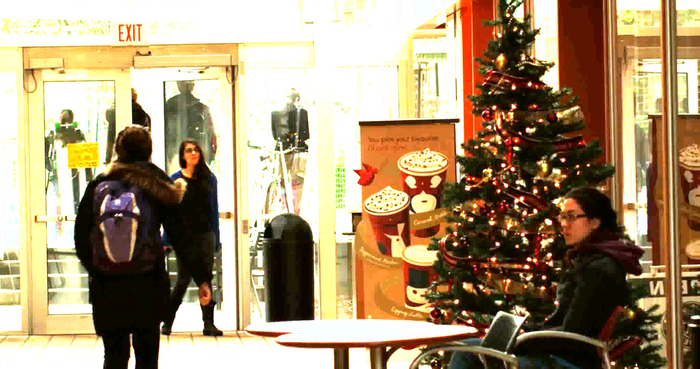|
|diff|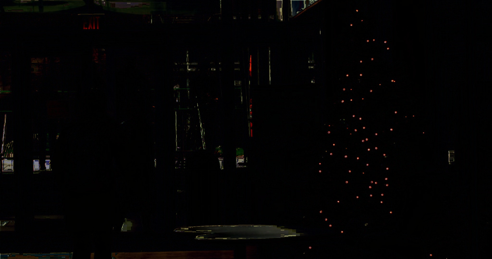|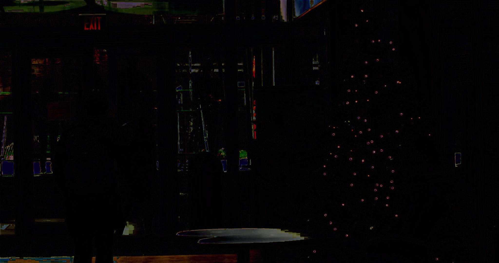|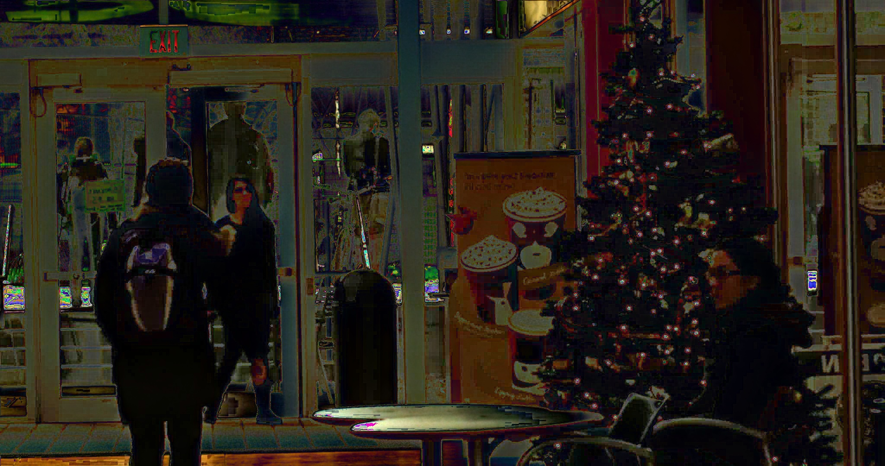|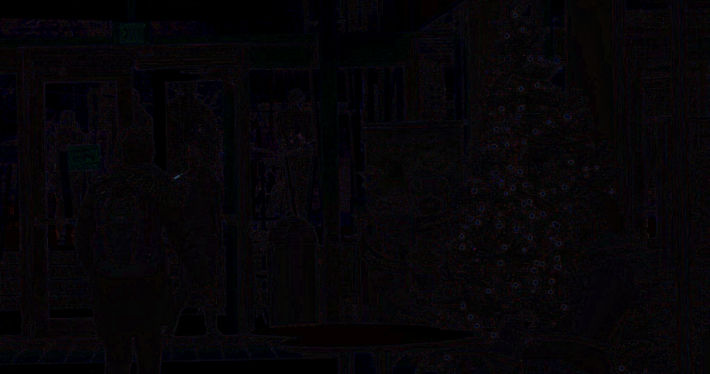|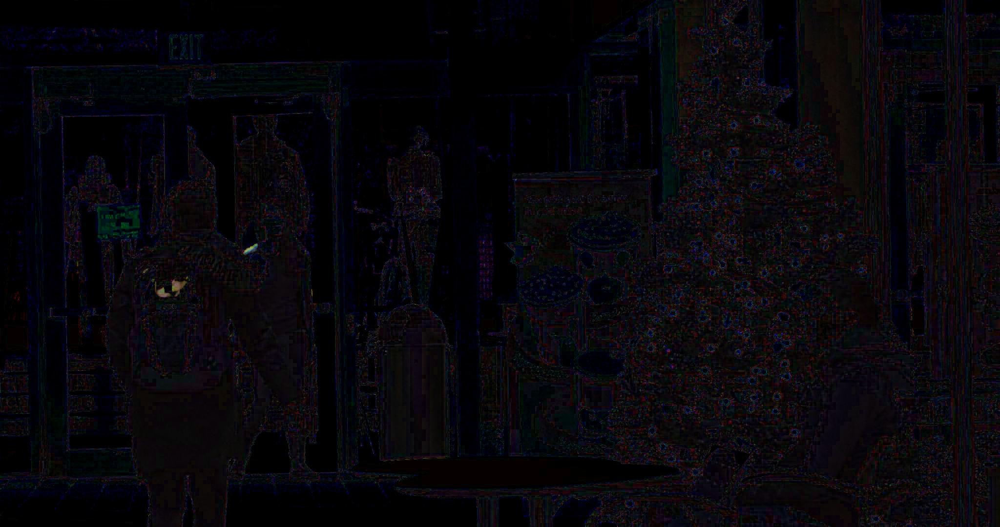|  

These images are generated using [example/christmas_tree.ipynb](example/christmas_tree.ipynb).  
`0 fstop(Predict)` reconstructed by MergeMertens method.
## Usage
``` python
from unsupervised_hdr import UnsupervisedHDRModel
model = UnsupervisedHDRModel(
    video_path =VIDEO_PATH, # supporing only mp4 format
    encoder_lr = 1e-4,
    decoder_lr = 1e-4,
    num_worker = 1,
    device_ids = 0, # int (device_id) or None(using all gpu) or list(device_id array, ex. [0, 1])
    output_dir = LOGDIR_PATH)
model.fit(max_epoch=64, batch_size=1)
out = model.predict(
    frame_idx=None,  # None(all frames) or int(frame_idx) or list(frame_idx array, ex. [0, 100, 200])
    batch_size=1)
# out: {
# "hdr_image": reconstracted hdr image using MergeMertens of opencv(frames, h, w, c), 
# "exposure_list": [-4fstop, -2fstop, 0fstop(input), 2fstop, 4fstop]
# }
```
## TODO 
* [x] Multi GPU training
* [ ] Ealry stopping
* [ ] Dealing with the artifacts by convolution(other decoder)
* [ ] More data augmentation(ex. scale, crop)
* [ ] Support other pooling for default model(supported avg+max pooling only now)
* [x] Support imagenet pretrain timm encoder
    * [ ] Freeze batch normalization layer
    * Input image size must be a multiple of 16
* [ ] Support other pretrain method(ex. simsiam)
* [ ] Evaluate transfer learning
 
## Requirement
* PyTorch>=1.9.0
* timm>=0.5.4
* tqdm>=4.61.2

## Installation
Clone:  
`$ git clone --recursive https://github.com/tattaka/unsupervised-hdr-imaging.git`

Using pip:  
`$ cd unsupervised-hdr-imaging`  
`$ pip install .`

## License
This repository is under [MIT license](https://en.wikipedia.org/wiki/MIT_License).
